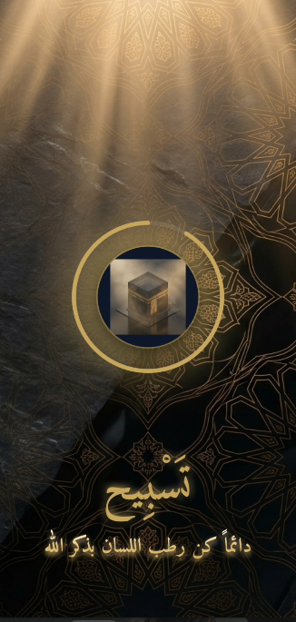
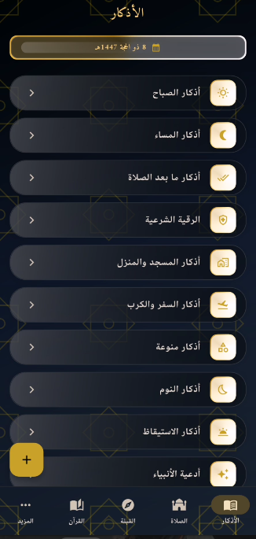
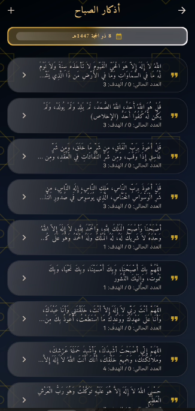
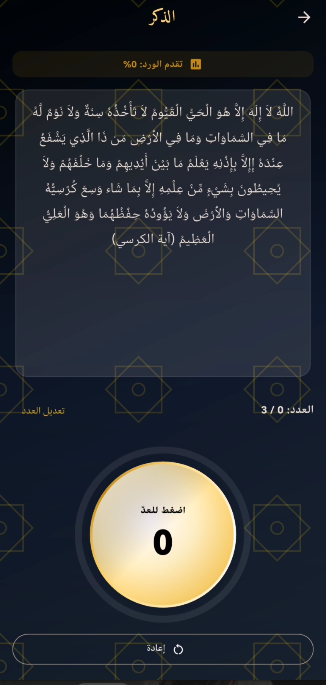
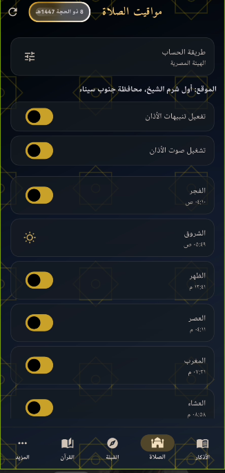

# 🕌 تطبيق تسبيح وأذكار ومواقيت الصلاة | Tasbeeh App

<p align="center">
  
</p>

<p align="center">
  <strong>تطبيق إسلامي متكامل يجمع بين روعة التصميم العصري ودقة الأداء البرمجي، رفيقك اليومي لذكر الله ومواقيت الصلاة.</strong>
</p>

---

## 📸 شاشات التطبيق | App Screenshots

<p align="center">
  
  
  
  
  
</p>

---

## ✨ مميزات التطبيق | Key Features

### 🇸🇦 باللغة العربية:
* **🎨 تصميم زجاجي فاخر (Premium Glassmorphism):** واجهة مستخدم مبهرة بصرياً تعتمد على تداخل الألوان الداكنة والذهبية مع تأثيرات زجاجية راقية وتأثيرات حركية فائقة السلاسة.
* **🕌 أوقات الصلاة بدقة متناهية:** حساب دقيق لمواقيت الصلاة بناءً على موقعك الجغرافي الفعلي مع دعم مختلف هيئات الحساب العالمية (الهيئة المصرية للمساحة، أم القرى، رابطة العالم الإسلامي، وغيرها).
* **🔊 أذان كامل تفاعلي:** منبه أذان متكامل يظهر بملء الشاشة مع لوحة تحكم تفاعلية لرفع وخفض الصوت وإيقاف المؤقت، ومحمي بالكامل ضد مقاطعة الإشعارات الأخرى أو سحب القائمة.
* **📿 عداد تسبيح ذكي:** واجهة تفاعلية للعد بلمسات انسيابية ومؤشر دائري متوهج مع اهتزازات خفيفة ومحاكية للسبحة الحقيقية.
* **📖 موسوعة الأذكار الشاملة:** تصنيف منسق للأذكار اليومية (الصباح، المساء، أذكار الصلاة، النوم، السفر، الرقية الشرعية، وأدعية الأنبياء) مع بطاقات زجاجية توضح أعداد التكرار.
* **🕋 شاشة القبلة والقرآن الكريم:** محاذاة للقبلة وتصفح كامل لصفحات المصحف الشريف المصممة بجودة عالية وأحجام محسنة ومضغوطة جداً لتوفير المساحة.

---

### 🇬🇧 In English:
* **🎨 Premium Glassmorphism Design:** A visually stunning dark & gold themed user interface utilizing glassmorphism textures and ultra-smooth animations.
* **🕌 High-Precision Prayer Times:** Highly accurate computation based on your GPS coordinates, supporting global calculation methods (Egyptian Survey Authority, Umm Al-Qura, MWL, etc.).
* **🔊 Interactive Full-Screen Adhan:** A robust full-screen alert overlay with active gesture-based volume sliders, fully immune to system audio interrupts.
* **📿 Elegant Dhikr Counter:** Smooth, glowing circular progress indicator simulating native physical tasbeeh counting.
* **📖 Comprehensive Athkar Library:** Categorized daily supplications (Morning, Evening, Post-Prayer, Travel, Sleep, Ruqyah, etc.) with responsive countdown tracking.
* **🕋 Qibla & Holy Quran:** Accurate Qibla finder and complete optimized page-by-page Holy Quran Mushaf view.

---

## 🛠️ البنية التقنية للمشروع | Tech Stack

* **Framework:** Flutter (Dart)
* **Local Storage:** Hive & SharedPreferences (Super fast, offline storage)
* **Audio Engine:** Audioplayers (customized audio context protection)
* **Notifications:** Flutter Local Notifications (configured with Android exact alarms & custom channels)
* **Prayer Calculation:** Adhan package integration

---

## 🚀 كيفية تشغيل وتثبيت المشروع | Getting Started

### 📋 المتطلبات | Prerequisites
* [Flutter SDK](https://docs.flutter.dev/get-started/install) (3.x or higher)
* [Android SDK](https://developer.android.com/studio)

### 💻 خطوات التشغيل | Build Instructions

1. **تحميل الكود البرمجي (Clone):**
   ```bash
   git clone <REPO_URL>
   cd tasbeeh_app
   ```

2. **تحميل الحزم والمكتبات (Get Dependencies):**
   ```bash
   flutter pub get
   ```

3. **تشغيل التطبيق في وضع التطوير (Run Debug):**
   ```bash
   flutter run
   ```

4. **بناء النسخة النهائية المخففة للهواتف (Build Optimized APKs):**
   ```bash
   flutter build apk --split-per-abi --release
   ```
   *(ستجد ملفات الـ APK الجاهزة داخل مسار `build/app/outputs/flutter-apk/` بحجم خفيف جداً ومثالي لمختلف الهواتف).*

---

## 📄 رخصة المشروع | License
هذا المشروع متاح بشكل حر كصدقة جارية، لا تتردد في استخدامه وتعديله ونشره لتعم الفائدة. نسألكم الدعاء.
This project is open-source and free to distribute. If you find it helpful, please keep us in your prayers.
